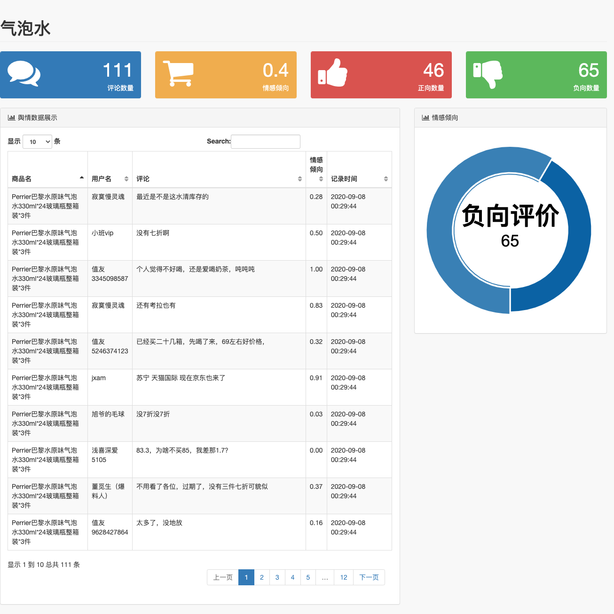

# 爬虫 + 展示 系统

## 步骤一：爬虫

### 使用scrapy爬取数据

##### 1. 创建爬虫项目：

```Shell
scrapy startproject zdm_spiders
```

##### 2. 创建爬虫

```Shell
scrapy genspider qibaoshui smzdm.com
```

##### 3. 修改 Scrapy Settings

##### 4. 定义想要爬取的字段

```Python
# items.py
import scrapy
class ProductAnalysisItem(scrapy.Item):
    product_name = scrapy.Field()
    user_name = scrapy.Field()
    user_comment = scrapy.Field()
```

##### 5. 创建数据表

```mysql
CREATE TABLE product
 (
 id BIGINT(20) PRIMARY KEY NOT NULL AUTO_INCREMENT,
 product_name VARCHAR(128) COMMENT '商品名',
 user_name VARCHAR(128) COMMENT '用户名',
 user_comment VARCHAR(768) COMMENT '用户评论',
 create_time DATETIME COMMENT '入库时间'
 ) DEFAULT CHARSET=utf8mb4;
```

##### 6. 定义数据存储逻辑

##### 7. 写爬取逻辑：

##### 8. 创建运行爬虫的脚本

##### 9. 创建定时任务


## 步骤二：展示

### 使用Django展示步骤一中保存到数据库的数据

##### 1. 创建Django项目

```Shell
django-admin startproject zdm_show
```

##### 2. 创建展示app

```Shell
django-admin startapp product_show
```

##### 3. 修改配置文件

##### 4. 修改主程序的路由逻辑

##### 5. 修改具体app中的路由逻辑

##### 6. 添加数据模型文件

```Shell
# 查看数据库中已经存在模型
python manage.py inspectdb
```

##### 7. 拷贝templates和static中的文件到app目录

##### 8. 准备模板中使用的数据

```Python
# views.py
from django.db.models import Avg
from django.shortcuts import render
# Create your views here.
from .models import ProductCleaned

def qipaoshui(req):
    ## 取出数据库内容
    contents = ProductCleaned.objects.all()
    ## 评论数量
    counter = len(contents)
    ## 情感倾向
    sent_avg = f"{contents.aggregate(Avg('sentiment'))['sentiment__avg']:0.1f}"
    ## 正向数量
    plus = contents.filter(sentiment__gte=0.5).count()
    ## 负向数量
    minus = contents.filter(sentiment__lt=0.5).count()
    page_name = '气泡水'
    return render(req, 'result.html', locals())
```

##### 9. 修改模板，显示上面数据到页面

##### 10. 启动Django 展示结果

```shell
python manage.py runserver
```


